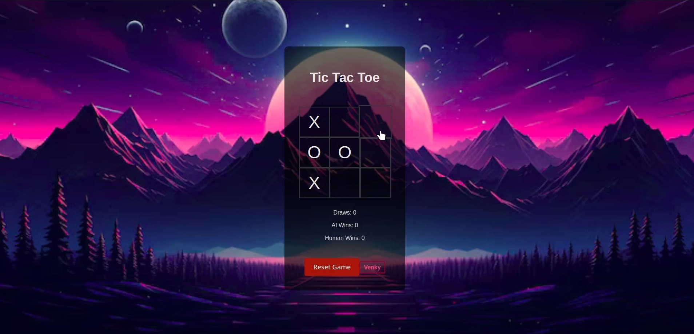
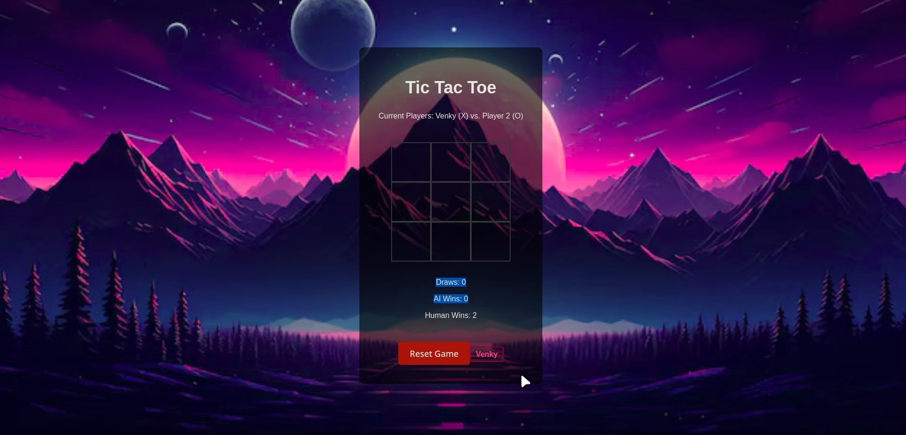

# Tic Tac Toe Game

This Tic Tac Toe Game was developed as the final project for the CS50’s Introduction to Programming with Python. It is a full-stack application that allows users to play the classic Tic Tac Toe game in both single-player and multiplayer modes.

## Overview

The application enables users to:
- Play Tic Tac Toe in single-player mode against an AI.
- Play Tic Tac Toe in multiplayer mode with another human player.
- Keep track of the score for wins, draws, and losses.

The application leverages various modern web technologies to provide an engaging user experience.

## Features

- **Single Player:** Play against an AI opponent. The AI uses the Minimax algorithm to provide a challenging game.
- **Multiplayer:** Play against another human player on the same device.
- **Score Tracking:** Keep track of the number of wins, draws, and losses for both players.

## Technologies Used

- **Express:** A web application framework for Node.js, used for building the backend server.
- **Flask:** Used for the backend logic, particularly for handling game moves and AI logic.
- **React:** A JavaScript library for building user interfaces, used for developing the frontend.
- **HTML/CSS:** Used for structuring and styling the frontend components.
- **Axios:** Used for making HTTP requests from the frontend to the backend.
- **Zod Validation:** Ensures data integrity and validation of input.

## Screenshots

### Single Player


### Multiplayer


## Demonstration on YouTube

For the CS50 final project, a video demonstration is required. You can view the presentation of this project on YouTube:
[My Final Project Presentation](https://youtu.be/KotI8INZ530)

## Installation

To run this application locally, follow these steps:

1. Clone the repository:
    ```bash
    git clone <repository-url>
    ```

2. Navigate to the project directory:
    ```bash
    cd tic-tac-toe
    ```

3. Install the dependencies:
    ```bash
    npm install
    ```

4. Start the development server:
    ```bash
    npm start
    ```

## Usage

1. Open your web browser and access the application.
2. Choose either single-player or multiplayer mode.
3. In single-player mode, play against the AI.
4. In multiplayer mode, play against another human player on the same device.
5. The application will keep track of wins, draws, and losses.

## Project Structure

The project is organized into several key directories and files:

- **Backend:**
  - `app.py`: The main entry point for the backend server.
  - `routes/`: Contains route definitions for handling various API endpoints.
  - `models/`: Contains Mongoose models for defining the structure of data in MongoDB.
  - `controllers/`: Contains functions that handle the logic for different routes.

- **Frontend:**
  - `src/`: Contains the source code for the React application.
  - `components/`: Contains React components used in the application.
  - `assets/`: Contains static assets such as images and sound files.

## API Endpoints

The backend API provides several endpoints for interacting with the game data. Below are some of the key endpoints:

- **POST /move:** Handle a player's move and return the updated game state.
- **GET /score:** Retrieve the current score for wins, draws, and losses.


## License

This project is licensed under the MIT License. See the [LICENSE](LICENSE) file for details.

## Acknowledgements

I would like to thank the CS50 course instructors and staff for providing a comprehensive introduction to computer science and programming. This project is a culmination of the skills and knowledge acquired throughout the course. Special thanks to my peers and mentors who provided feedback and support during the development process.

## Contact

For any questions or suggestions, please contact me at [venkyvenkat.iit@gmail.com](mailto:venkyvenkat.iit@gmail.com).

## Lessons Learned

Developing this Tic Tac Toe Game provided valuable insights into full-stack development, including:

- **Backend Development:** Building a robust backend with Express and Flask, handling data validation with Zod, and designing RESTful APIs.
- **Frontend Development:** Creating dynamic and responsive user interfaces with React, managing state, and ensuring a seamless user experience.
- **Project Management:** Planning and organizing the development process, managing dependencies, and ensuring code quality and maintainability.
- **Problem Solving:** Tackling various challenges that arose during development, such as handling asynchronous operations, debugging issues, and optimizing performance.

By completing this project, I gained a deeper understanding of the principles and practices of modern web development, which will be invaluable in future projects and professional endeavors.
